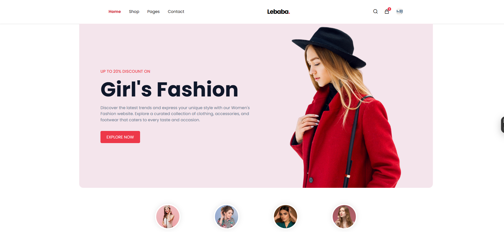

# MERN Stack E-Commerce Application



[]()
[]()
[]()

Table of Contents
- Project Overview
- Demo (Screenshots & Flow)
- Features
- Architecture & Tech Stack
- Getting Started (Local Development)
  - Prerequisites
  - Environment variables
  - Backend
  - Frontend
  - Seed sample data
- API Endpoints (Overview)
- Authentication & Payments
- Production Build & Deployment
  - Using Docker
  - Deploying to common hosts
- Testing
- Performance & Security Notes
- Contributing
- License
- Contact

Project Overview
----------------
This repository contains a modern e-commerce application built with the MERN stack (MongoDB, Express, React, Node). It demonstrates a complete shopping flow: products catalog, search & filtering, shopping cart, checkout, order management, payment integration, user authentication, and an admin panel for product and order management.

Demo (Suggested screenshots & flow)
----------------------------------
1. Homepage with featured products
2. Product detail page
3. Cart and checkout flow
4. User dashboard (orders)
5. Admin panel (products, orders, users)

Add screenshots in `public/` or `docs/` and reference them at the top of this README. Example names: `screenshot-home.png`, `screenshot-product.png`, `screenshot-checkout.png`.

Features
--------
- Responsive React frontend (client)
- RESTful API built with Express and Node (server)
- MongoDB for data persistence (Mongoose models)
- JWT authentication with refresh token support
- Role-based access (user vs admin)
- Product search, filtering, pagination
- Cart, checkout, orders, order history
- Payment integration (Stripe example)
- Image upload support (local / cloud)
- Seed scripts to populate dev database
- Dockerfile and docker-compose for quick local deployments
- Tests for critical endpoints and components (suggested)

Architecture & Tech Stack
-------------------------
- Client: React, React Router, Redux or Context API, Axios, Tailwind/CSS framework
- Server: Node.js, Express, Mongoose
- Database: MongoDB (Atlas or local)
- Payments: Stripe (or replace with another gateway)
- Authentication: JWT (access + refresh tokens)
- Deployment: Heroku / Render / Vercel (split client/server) or Docker
- Optional: Nginx reverse proxy, Redis for caching/sessions

Getting Started (Local Development)
-----------------------------------

Prerequisites
- Node.js (16+) and npm or yarn
- MongoDB (local or Atlas)
- Optional: Docker & docker-compose

Clone repository
```bash
git clone https://github.com/ShahRIyar-Rahim/mern-stack-ecommerce-application.git
cd mern-stack-ecommerce-application
```

Environment variables
Create `.env` files for both server and client as required.

Example: server/.env
```
PORT=5000
MONGO_URI=mongodb+srv://<user>:<pass>@cluster0.mongodb.net/your-db?retryWrites=true&w=majority
JWT_SECRET=your_jwt_secret_here
JWT_EXPIRES_IN=1h
REFRESH_TOKEN_SECRET=your_refresh_secret_here
STRIPE_SECRET_KEY=sk_test_...
NODE_ENV=development
CLIENT_URL=http://localhost:3000
```

Example: client/.env (prefix with REACT_APP_)
```
REACT_APP_API_URL=http://localhost:5000/api
REACT_APP_STRIPE_PUBLISHABLE_KEY=pk_test_...
```

Backend (server)
```bash
cd server
npm install
# or
yarn

# run in development with automatic reload
npm run dev
# or
yarn dev

# production
npm start
```
Common scripts:
- dev — run server with nodemon
- start — production node server.js
- seed:dev — seed sample products and admin user

Frontend (client)
```bash
cd client
npm install
# or
yarn

# dev
npm start
# or
yarn start

# build for production
npm run build
```

Seed sample data
- The repo contains a seed script that inserts sample products, categories, and an admin user into MongoDB.
- From the server folder:
```bash
# seed sample data
npm run seed:import
# or to remove seeded data
npm run seed:destroy
```

API Endpoints (Overview)
------------------------
Base: /api

Auth
- POST /api/auth/register — register user
- POST /api/auth/login — login (returns access token & refresh token)
- POST /api/auth/refresh — exchange refresh token for access token
- POST /api/auth/logout — revoke refresh token

Products
- GET /api/products — list (query: search, category, page, limit, sort)
- GET /api/products/:id — product details
- POST /api/products — create (admin)
- PUT /api/products/:id — update (admin)
- DELETE /api/products/:id — delete (admin)

Cart & Orders
- POST /api/cart — update cart (user)
- POST /api/orders — create order (user)
- GET /api/orders/:id — get order (user/admin)
- GET /api/orders — list orders (admin or user=own)

Payments
- POST /api/payments/create-payment-intent — create Stripe PaymentIntent
- Webhook endpoint: POST /api/payments/webhook — Stripe webhook for confirmations

Examples (curl)
```bash
# get products
curl http://localhost:5000/api/products

# login
curl -X POST http://localhost:5000/api/auth/login -H "Content-Type: application/json" -d '{"email":"test@example.com","password":"123456"}'
```

Authentication & Payments
-------------------------
- JWT access tokens are short lived; refresh tokens stored securely (e.g., HttpOnly cookies).
- Use HTTPS in production.
- Payments use Stripe Payment Intents. Example workflow:
  1. Client requests payment intent creation from server with order summary.
  2. Server creates PaymentIntent with Stripe secret key and returns client secret.
  3. Client completes payment with Stripe.js using the client secret.
  4. Server verifies via webhook and updates order status.

Production Build & Deployment
-----------------------------
Production (single-server example)
1. Build the React client: `cd client && npm run build`
2. Serve static `client/build` from Express in production mode.
3. Start server: `NODE_ENV=production node server.js`
4. Use process manager (PM2) or Docker for stability.

Docker (quick start)
- Example docker-compose (idea):
  - server service
  - client service (or serve built client from server)
  - mongo service
  - optional: nginx reverse proxy

Deploying
- Render / Heroku: Separate client and server; set environment variables on the host; configure build & start commands.
- Vercel: Deploy client only (if static) and host server on Render/Heroku.
- Docker: Build and push images to a registry, and deploy to a host supporting Docker.

Testing
-------
- Unit tests for backend routes (Jest + Supertest recommended).
- Integration tests for auth and checkout flows.
- E2E tests for critical user journeys (Cypress).
- Example: `npm run test` in server runs unit/integration tests.

Performance & Security Notes
----------------------------
- Use indexes in MongoDB for commonly queried fields (title, category).
- Implement rate limiting and request body size limits.
- Store secrets in environment variables; never commit .env to repo.
- Validate and sanitize inputs to prevent injection attacks.
- Serve images/CDN for large media.
- Use caching (Redis) for sessions or frequently requested data if needed.

Contributing
------------
Thanks for your interest! A suggested workflow:
1. Fork the repo
2. Create a feature branch: `git checkout -b feat/awesome-feature`
3. Run tests and linters
4. Open a pull request with a clear description and screenshots

Include an ISSUE_TEMPLATE and CONTRIBUTING.md for specifics.

License
-------
This project is open-source and available under the MIT License. See LICENSE for details.

Contact
-------
- Maintainer: Shahriyar Rahim
- GitHub: [Shahriyar-Rahim](https://github.com/Shahriyar-Rahim)

Acknowledgements
----------------
- Built with ❤️ using the MERN stack
- Thanks to open-source libraries used: Express, React, Mongoose, Redux, Stripe, Tailwind (or Bootstrap)

Quick Tips (replace placeholders)
- Replace screenshot path to display a real image
- Add actual URLs for badges and remove placeholder badge links
- Fill contact info & license file
- Add any CI/CD instructions (GitHub Actions) if you use them

---
